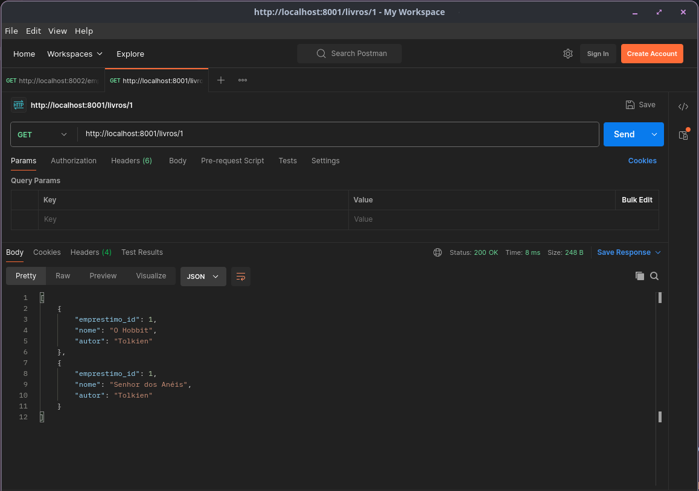
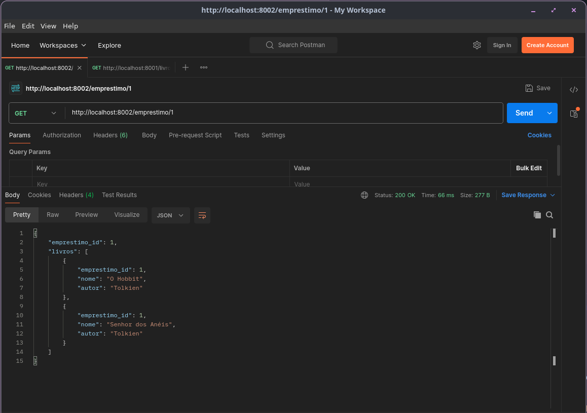
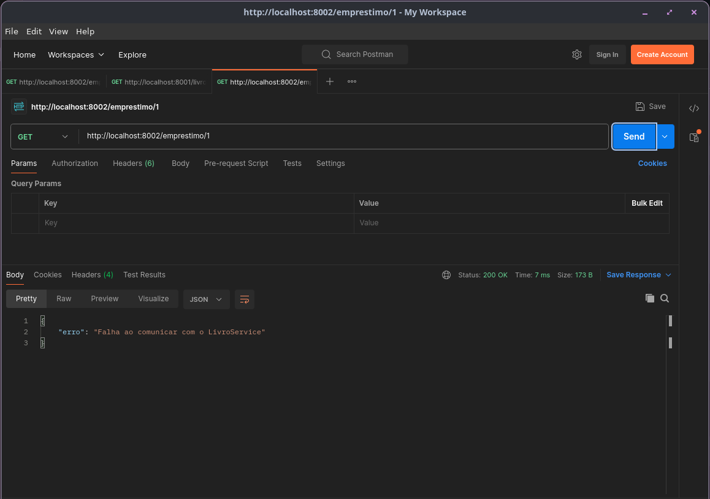
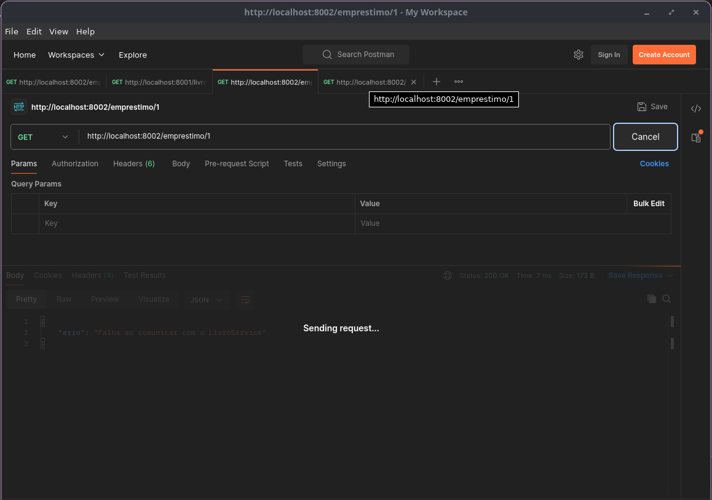

# Atividade 06 - Microsserviços com FastAPI e Docker

## Descrição da atividade

Implementar e analisar a comunicação síncrona entre dois microsserviços, e identificar problemas de acoplamento, latência e falhas.

### Tecnologias, ferramentas e arquiteturas

- **FastAPI**
- **Docker**
- **API REST**
- **Postman**

### Serviços

- **LivroService**: retorna dados de livros simulados.
- **EmprestimoService**: consome o LivroService via HTTP e retorna dados de empréstimos.

## Como rodar

1. Clonar o repositório:
```
git clone https://github.com/alexikeda-ifsp/aula_06_microsservicos_fastapi.git
```

2. Abrir a pasta onde o repositório foi clonado e subir os serviços via Docker:

```bash
sudo docker compose up --build
```

3. Acessar endpoint LivroService via Postman:
```
http://localhost:8001/livros/1
```


4. Acessar endpoint EmprestimoService via Postman: 
```
http://localhost:8002/emprestimo/1
```


## Simulações realizadas

#### Falha na comunicação com o LivroService

1. Parei o serviço LivroService:

```bash
sudo docker compose stop livroservice
```

2. Acessei o endpoint do EmprestimoService pelo Postman:

```
http://localhost:8002/emprestimo/1
```

3. Resultado:

```JSON
{
  "erro": "Falha ao comunicar com o LivroService"
}
```


#### Timeout / Latência

1. Adicionei time.sleep(2) no main.py do LivroService:

```Python
import time
time.sleep(2)
```

2. Chamei o endpoint do EmprestimoService:

```
http://localhost:8002/emprestimo/1 
```

3. Resultado: 

```
Atraso na resposta
```


## Problemas observados neste tipo de implementação

- **Acoplamento**: EmprestimoService depende do LivroService. Se o LivroService cair, o EmprestimoService é impactado diretamente.

- **Latência**: Cada chamada HTTP entre serviços aumenta o tempo de resposta.

- **Falhas**: Falhas de rede ou serviço indisponível afetam diretamente o consumidor.

- **Resiliência**: Sem timeout, retry ou circuit breaker, o sistema pode travar ou responder lentamente se houver atrasos ou falhas.

- **Tratamento de erros**: Necessário tratar exceções, retornando mensagens claras, como mostrado na simulação de falha.